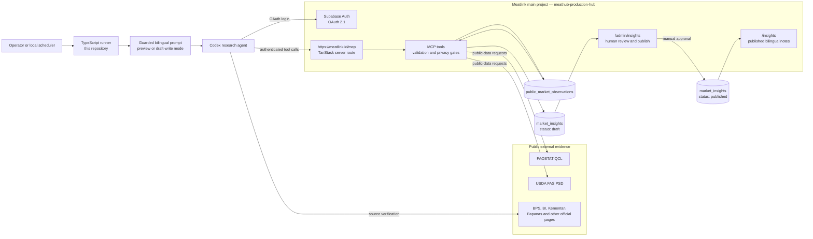

# Meatlink Analytical Engine

A guarded Codex agent runner that researches public beef-market signals and creates bilingual Meatlink sourcing-insight drafts.

The engine uses Meatlink's authenticated MCP server and Codex's web research. It deliberately excludes all Meatlink marketplace inventory, order, RFQ, user, buyer, vendor, private-location, and internal-price data.

## Repository relationship

This repository is the analysis and orchestration layer. It does not contain the Meatlink website, database schema, MCP implementation, or production credentials.

| Repository | Responsibility |
| --- | --- |
| [`revanza-git/meatlink-analytical-engine`](https://github.com/revanza-git/meatlink-analytical-engine) | Starts the guarded Codex workflow, selects regions and periods, enforces preview/write modes, and reports the result. |
| [`revanza-git/meathub-production-hub`](https://github.com/revanza-git/meathub-production-hub) | Hosts `meatlink.id`, the OAuth-protected `/mcp` endpoint, MCP tool validation, Supabase persistence, admin review, and the public Insights page. |

Keeping the repositories separate prevents the analytical runner from receiving direct database credentials. All Meatlink data access and draft writes cross the authenticated Meatlink MCP boundary.

## Architecture



The analytical engine never connects directly to Supabase. FAOSTAT credentials and the USDA API key remain server-only secrets in the main project; the runner uses the public-data tool without receiving those secrets.

## Draft-generation flow

```mermaid
sequenceDiagram
    autonumber
    actor Operator
    participant Runner as Analytical runner
    participant Codex as Codex agent
    participant MCP as Meatlink MCP
    participant Sources as Official public sources
    participant DB as Supabase
    actor Admin as Meatlink admin

    Operator->>Runner: Select regions, period and preview/write mode
    Runner->>Codex: Start ephemeral guarded analysis
    Codex->>MCP: list_market_insights
    MCP->>DB: Check for duplicate topics
    Codex->>MCP: get_public_beef_market_data
    MCP->>Sources: Read FAOSTAT and USDA FAS
    Codex->>Sources: Verify current Indonesian evidence
    Codex->>MCP: list_public_market_observations
    MCP->>DB: Check existing evidence

    alt Preview mode
        Codex-->>Runner: Proposed bilingual payloads only
    else Write mode with eligible evidence
        Codex->>MCP: record_public_market_observation
        MCP->>DB: Save candidate evidence
        Codex->>MCP: review_public_market_observation
        MCP->>DB: Mark checked evidence verified or rejected
        Codex->>MCP: create_market_insight
        MCP->>DB: Validate freshness, privacy and bilingual fields; save draft
        Codex-->>Runner: Return draft IDs and evidence lineage
    end

    Admin->>DB: Review, edit and publish approved drafts
```

### Trust boundaries

- **Local authentication:** Meatlink OAuth credentials are stored by Codex, not in this repository.
- **Server secrets:** FAOSTAT and USDA credentials stay in the main project's server environment and never use a browser-visible `VITE_` prefix.
- **Evidence gate:** a draft needs a recent public observation—price evidence no older than seven days or other eligible context no older than 30 days.
- **Privacy gate:** the MCP rejects insight text that appears to contain Meatlink internal marketplace data.
- **Publication gate:** the agent can create `draft` records only; publishing remains a human action in `/admin/insights`.
- **Cloud boundary:** GitHub Actions runs CI checks only. It does not receive production OAuth credentials or generate articles.

## What it does

1. Checks existing insights to prevent duplicates.
2. Retrieves public FAOSTAT/USDA context through Meatlink.
3. Verifies current Indonesian signals against primary official sources.
4. Records and reviews traceable public-market observations.
5. Produces equivalent Bahasa Indonesia and English articles.
6. Creates unpublished drafts for an administrator to review.

Preview mode is the default and performs no database writes.

## Requirements

- Node.js 22 or newer
- Codex CLI installed and signed in
- Meatlink MCP configured with the exact non-redirecting URL
- A Meatlink account authorized to create market-insight drafts

## Setup

```powershell
npm install
codex mcp add meatlink --url https://meatlink.id/mcp
codex mcp login meatlink
```

Complete the Meatlink OAuth consent in your browser. Never paste a Meatlink password, OAuth token, or Supabase service-role key into this repository.

Verify the connection:

```powershell
codex mcp list
```

The `meatlink` row must show `enabled` and `OAuth`.

## Run safely

Preview two proposed articles without writing:

```powershell
npx --no-install tsx src/index.ts --dry-run --regions="Jawa Timur,Sulawesi Selatan" --period="September 2026"
```

Create two unpublished drafts:

```powershell
npx --no-install tsx src/index.ts --write --regions="Jawa Timur,Sulawesi Selatan" --count=2 --period="September 2026"
```

For the default two regions, `npm run preview` and `npm run generate -- --write` are convenient shortcuts.

Supported options:

- `--regions`: comma-separated Indonesian provinces or market regions
- `--count`: number of articles, from 1 to 10 and no larger than the region list
- `--period`: article period label
- `--dry-run`: explicit preview mode
- `--write`: allow verified public observations and draft insight writes

Environment overrides:

- `MEATLINK_REGIONS`
- `MEATLINK_ARTICLE_COUNT`
- `MEATLINK_MCP_NAME` (default: `meatlink`)
- `CODEX_CLI_PATH`

## Automation boundary

This runner is suitable for a local Codex automation on a machine whose Meatlink OAuth session is available. The included GitHub Actions workflow runs tests only.

Do not schedule draft generation on a hosted GitHub runner using a superadmin password, Supabase `service_role` key, or copied short-lived OAuth token. Fully unattended cloud execution should wait for a dedicated, revocable, least-privilege Meatlink service-authentication mechanism.

If a run reports `OAuth refresh failed`, reconnect locally with `codex mcp login meatlink` before retrying. The engine detects this condition and stops instead of continuing with incomplete market data.

## Development

```powershell
npm run check
```
